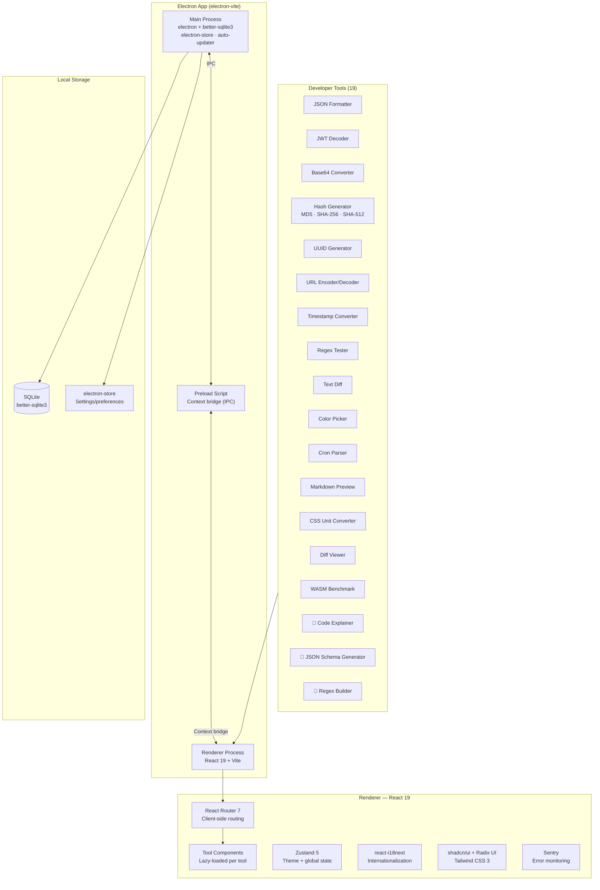

# Dev Utils Hub

> 개발자를 위한 올인원 유틸리티 — Electron 데스크톱 앱 + 오프라인 PWA
> All-in-one developer utilities — cross-platform Electron desktop app with offline PWA support

[](https://github.com/jellive/dev-utils-hub/actions/workflows/ci.yml)
[](https://nodejs.org)
[](https://www.electronjs.org)
[](https://react.dev)
[](https://www.typescriptlang.org)
[](https://vitest.dev)
[](LICENSE)

---

## Architecture



### Tool Loading (Code Splitting)

```mermaid
flowchart LR
    ENTRY["App Entry<br/>main.tsx"] --> ROUTER["React Router<br/>route config"]
    ROUTER -->|lazy()| T1["JsonFormatter<br/>chunk"]
    ROUTER -->|lazy()| T2["JwtDecoder<br/>chunk"]
    ROUTER -->|lazy()| T3["HashGenerator<br/>chunk"]
    ROUTER -->|lazy()| T4["...7 more<br/>chunks"]
    T1 & T2 & T3 & T4 --> SUSPENSE["Suspense<br/>loading fallback"]
```

### Bundle Size Optimization

```mermaid
xychart-beta
    title "Bundle Size Before vs After (KiB)"
    x-axis ["Total", "HashGenerator"]
    y-axis "Size (KiB)" 0 --> 350
    bar [310.78, 75.16]
    bar [244.42, 7.85]
```



---

## Tech Stack


| Category       | Technology                 | Notes                                  |
| -------------- | -------------------------- | -------------------------------------- |
| Desktop        | Electron 32                | Cross-platform (macOS, Windows, Linux) |
| Bundler        | electron-vite 4 + Vite 7   | HMR in dev, optimized builds           |
| UI             | React 19                   | Concurrent features                    |
| Styling        | Tailwind CSS 3 + shadcn/ui | Radix UI primitives                    |
| State          | Zustand 5                  | Theme and preferences                  |
| Routing        | React Router 7             | Client-side navigation                 |
| Database       | better-sqlite3             | Local data persistence                 |
| i18n           | react-i18next              | Multi-language support                 |
| Monitoring     | Sentry 10                  | Error tracking + breadcrumbs           |
| Testing (Unit) | Vitest 4                   | 162 tests                              |
| Testing (E2E)  | Playwright                 | Cross-browser                          |
| CI/CD          | GitHub Actions             | Lint, type-check, test                 |
| Distribution   | electron-builder           | macOS, Windows, Linux                  |

---

## Tools

### Converters

| Tool                    | Description                                 | Web APIs Used |
| ----------------------- | ------------------------------------------- | ------------- |
| **Base64 Converter**    | Encode/decode Base64 (UTF-8 support)        | —             |
| **URL Encoder/Decoder** | URL encode/decode with special char support | —             |
| **Timestamp Converter** | Unix timestamp ↔ human-readable date        | —             |

### Generators

| Tool               | Description                      | Web APIs Used  |
| ------------------ | -------------------------------- | -------------- |
| **UUID Generator** | Cryptographically secure UUID v4 | Web Crypto API |
| **Hash Generator** | MD5, SHA-256, SHA-512 hashes     | Web Crypto API |

### Formatters & Validators

| Tool               | Description                                | Web APIs Used |
| ------------------ | ------------------------------------------ | ------------- |
| **JSON Formatter** | Format, validate, and minify JSON          | —             |
| **JWT Decoder**    | Decode header, payload, verify expiry      | —             |
| **Regex Tester**   | Live regex testing with match highlighting | —             |

### Text Utilities

| Tool          | Description                  | Web APIs Used |
| ------------- | ---------------------------- | ------------- |
| **Text Diff** | Side-by-side text comparison | —             |

### Formatters & Viewers

| Tool                 | Description                                           | Web APIs Used |
| -------------------- | ----------------------------------------------------- | ------------- |
| **Markdown Preview** | Live Markdown → HTML preview with syntax highlighting | —             |
| **Diff Viewer**      | Rich side-by-side diff with syntax highlighting       | —             |

### Design Utilities

| Tool                   | Description                                 | Web APIs Used |
| ---------------------- | ------------------------------------------- | ------------- |
| **Color Picker**       | HSL/RGB/HEX picker with clipboard copy      | —             |
| **CSS Unit Converter** | px ↔ rem ↔ em ↔ vw/vh with base-font config | —             |

### Developer Utilities

| Tool               | Description                                              | Web APIs Used   |
| ------------------ | -------------------------------------------------------- | --------------- |
| **Cron Parser**    | Parse and explain cron expressions with next-run preview | —               |
| **WASM Benchmark** | Measure WebAssembly vs JS performance                    | WebAssembly API |

### Network

| Tool           | Description                               | Web APIs Used |
| -------------- | ----------------------------------------- | ------------- |
| **API Tester** | HTTP request builder with response viewer | Fetch API     |

#### API Tester — Details

The most full-featured tool in the suite.

**Supported HTTP methods:** GET · POST · PUT · DELETE · PATCH · HEAD · OPTIONS

**Authentication types:**

| Type         | Details                                            |
| ------------ | -------------------------------------------------- |
| None         | No auth header added                               |
| Bearer Token | `Authorization: Bearer <token>`                    |
| Basic Auth   | Username + password, Base64-encoded                |
| API Key      | Custom key/value — added to header or query string |

**Request history:** Saved to `localStorage` under key `api-tester-history`. Persists across sessions; cleared per-browser-profile. Max entries managed in-memory.

[자세히 보기](docs/API-TESTER.md)

### AI-Powered

> **🤖 AI** tools require an AI provider to be configured. Supported providers: **OpenAI**, **Google (Gemini)**, **Ollama (local)**. API keys are stored in `localStorage` via Zustand persist.

| Tool                      | Description                                                                     | Providers                         |
| ------------------------- | ------------------------------------------------------------------------------- | --------------------------------- |
| **Code Explainer**        | Line-by-line code explanation with complexity analysis                          | OpenAI · Google (Gemini) · Ollama |
| **JSON Schema Generator** | Generate TypeScript interface, Zod schema, and JSON Schema from sample JSON     | OpenAI · Google (Gemini) · Ollama |
| **Regex Builder**         | Describe a pattern in plain English, get a regex with explanation and live test | OpenAI · Google (Gemini) · Ollama |

---

## Project Structure

```
dev-utils-hub/
├── src/
│   ├── main/                    # Electron main process
│   │   └── index.ts             # App lifecycle, IPC handlers
│   ├── preload/                 # Context bridge
│   │   └── index.ts             # Exposed APIs to renderer
│   └── renderer/                # React app
│       ├── src/
│       │   ├── components/
│       │   │   ├── tools/       # 19 tool components
│       │   │   │   ├── JsonFormatter.tsx
│       │   │   │   ├── JwtDecoder.tsx
│       │   │   │   ├── Base64Converter.tsx
│       │   │   │   ├── HashGenerator.tsx
│       │   │   │   ├── URLConverter.tsx
│       │   │   │   ├── TimestampConverter.tsx
│       │   │   │   ├── TextDiff.tsx
│       │   │   │   ├── RegexTester.tsx
│       │   │   │   ├── UUIDGenerator.tsx
│       │   │   │   ├── ColorPicker.tsx
│       │   │   │   ├── CronParser.tsx
│       │   │   │   ├── MarkdownPreview.tsx
│       │   │   │   ├── CssUnitConverter.tsx
│       │   │   │   ├── AICodeExplainer/
│       │   │   │   ├── AIJsonSchemaGenerator/
│       │   │   │   ├── AIRegexBuilder/
│       │   │   │   ├── DiffViewer/
│       │   │   │   ├── WasmBenchmark/
│       │   │   │   └── SentryToolkit/
│       │   │   └── ui/          # Shared UI primitives (shadcn)
│       │   ├── hooks/           # Custom React hooks
│       │   ├── store/           # Zustand stores
│       │   ├── lib/             # Utilities
│       │   └── App.tsx          # Root component + routing
├── e2e/                         # Playwright E2E tests
├── electron-builder.yml         # Distribution config
├── electron.vite.config.ts      # electron-vite config
├── vitest.config.ts
└── package.json
```

---

## Download

Prebuilt binaries are published to [GitHub Releases](https://github.com/jellive/dev-utils-hub/releases).

| Platform | Asset                                         |
| -------- | --------------------------------------------- |
| macOS    | `Dev-Utils-Hub_x.y.z_universal.dmg`           |
| Windows  | `Dev-Utils-Hub_x.y.z_x64-setup.exe`           |
| Linux    | `Dev-Utils-Hub_x.y.z_amd64.AppImage` + `.deb` |

### macOS — First Launch

Early releases are **not yet notarized** by Apple. On first launch you may see _"Dev Utils Hub is damaged and can't be opened"_. Bypass with:

```bash
xattr -cr "/Applications/Dev Utils Hub.app"
```

Then open normally. Code signing + notarization will be enabled in a future release.

---

## Getting Started

### Prerequisites

- **Node.js** 20+
- **npm** (bundled with Node.js)

### Install

```bash
git clone https://github.com/jellive/dev-utils-hub.git
cd dev-utils-hub
npm install
```

### Development

```bash
# Electron app (full desktop with IPC)
npm run dev

# Web-only mode (browser, no Electron APIs)
npm run dev:web
```

Open **http://localhost:5173** for web mode, or the Electron window opens automatically.

### Production Build

```bash
# Build Electron app
npm run build

# Build web-only bundle
npm run build:web

# Preview web build
npm run preview
```

### Distribution Packages

```bash
# All platforms
npm run dist

# macOS (.dmg + .zip)
npm run dist:mac

# Windows (.exe installer)
npm run dist:win

# Linux (.AppImage + .deb)
npm run dist:linux
```

### Environment Variables (optional)

```bash
# Sentry error monitoring
VITE_SENTRY_DSN="https://...@...ingest.sentry.io/..."
SENTRY_AUTH_TOKEN="sntrys_..."   # Source map upload
SENTRY_ORG="your-org-slug"
SENTRY_PROJECT="your-project"
```

---

## Scripts Reference

| Script                  | Description                    |
| ----------------------- | ------------------------------ |
| `npm run dev`           | Electron dev with HMR          |
| `npm run dev:web`       | Web-only dev server            |
| `npm run build`         | Electron production build      |
| `npm run build:web`     | Web-only production build      |
| `npm run type-check`    | TypeScript check (all targets) |
| `npm run lint`          | ESLint                         |
| `npm test`              | Vitest unit tests              |
| `npm run test:coverage` | Tests with coverage report     |
| `npm run test:e2e`      | Playwright E2E tests           |
| `npm run lighthouse`    | Lighthouse performance audit   |
| `npm run dist:mac`      | macOS distribution build       |
| `npm run dist:win`      | Windows distribution build     |
| `npm run dist:linux`    | Linux distribution build       |

---

## Testing

### Unit Tests (Vitest)

```bash
# Run all 162 unit tests
npm test

# Watch mode
npm run test:ui

# Coverage report
npm run test:coverage
```

**Coverage**: 162 unit tests covering all 19 tool components and utility functions.

### E2E Tests (Playwright)

```bash
# Run E2E tests
npm run test:e2e

# Interactive UI
npx playwright test --ui

# Specific browser
npx playwright test --project=chromium
```

**Supported browsers**: Chromium, Firefox, WebKit, Mobile Chrome (Pixel 5), Mobile Safari (iPhone 12)

---

## Performance

| Metric        | Before     | After      | Improvement |
| ------------- | ---------- | ---------- | ----------- |
| Total bundle  | 310.78 KiB | 244.42 KiB | **-21%**    |
| HashGenerator | 75.16 KiB  | 7.85 KiB   | **-90%**    |

**Optimizations applied:**

- **Native MD5** implementation — removed crypto-js (saves 75 KB)
- **Code splitting** via `React.lazy()` — 32% initial bundle reduction
- **Tree shaking** — unused code eliminated at build time
- **Terser minification** — production code compression

**Lighthouse targets:**

- Performance: 95–100
- Accessibility: 95–100
- Best Practices: 95–100
- PWA: 100

---

## Browser Support

| Browser        | Minimum Version |
| -------------- | --------------- |
| Chrome         | 87+             |
| Firefox        | 78+             |
| Safari         | 14+             |
| Edge           | 88+             |
| iOS Safari     | 14+             |
| Android Chrome | 87+             |

---

## Roadmap

- [x] Color Picker tool
- [x] Cron Expression parser
- [x] Markdown preview
- [ ] HTTP mock server (local)
- [ ] QR code generator/decoder
- [ ] Password strength checker
- [ ] Auto-update via electron-updater (in progress)

---

## License

MIT
