# Dev Utils Hub

> 개발자를 위한 올인원 유틸리티 — Tauri 데스크톱 앱 + 오프라인 PWA
> All-in-one developer utilities — cross-platform Tauri desktop app with offline PWA support

[](https://github.com/jellive/dev-utils-hub/actions/workflows/release.yml)
[](https://nodejs.org)
[](https://tauri.app)
[](https://react.dev)
[](https://www.typescriptlang.org)
[](https://vitest.dev)
[](LICENSE)

---

## Architecture

```mermaid
graph TB
    subgraph App["Tauri App"]
        CORE["Tauri Core (Rust)<br/>app lifecycle · system tray · auto-update"]
        PLUGINS["Tauri Plugins (Rust)<br/>store · updater · dialog · fs<br/>clipboard · global-shortcut · log · opener · autostart"]
        WEBVIEW["WebView (OS native)<br/>WKWebView / WebView2 / WebKitGTK"]
    end

    subgraph Frontend["Frontend — React 19"]
        ROUTER["React Router 7<br/>Client-side routing"]
        TOOLS["Tool Components<br/>Lazy-loaded per tool"]
        STATE["Zustand 5<br/>Theme + global state"]
        I18N["react-i18next<br/>ko / en"]
        UI["shadcn/ui + Radix UI<br/>Tailwind CSS 3"]
        SENTRY["Sentry<br/>Error monitoring"]
        PWA["vite-plugin-pwa<br/>Offline PWA support"]
    end

    subgraph Tools["Developer Tools (19)"]
        JSON["JSON Formatter"]
        JWT["JWT Decoder"]
        B64["Base64 Converter"]
        HASH["Hash Generator<br/>MD5 · SHA-256 · SHA-512"]
        UUID["UUID Generator"]
        URL["URL Encoder/Decoder"]
        TS["Timestamp Converter"]
        REGEX["Regex Tester"]
        DIFF["Text Diff"]
        COLOR["Color Picker"]
        CRON["Cron Parser"]
        MD["Markdown Preview"]
        CSS["CSS Unit Converter"]
        DIFFV["Diff Viewer"]
        WASM["WASM Benchmark"]
        SENTRY_T["Sentry Toolkit"]
        AICODE["🤖 Code Explainer"]
        AIJSON["🤖 JSON Schema Generator"]
        AIREGEX["🤖 Regex Builder"]
    end

    CORE <-->|Tauri IPC (invoke/event)| WEBVIEW
    PLUGINS <-->|Rust plugin API| CORE
    WEBVIEW --> ROUTER
    ROUTER -->|lazy()| TOOLS
    Tools --> Frontend
```

### Tool Loading (Code Splitting)

```mermaid
flowchart LR
    ENTRY["App Entry<br/>main.tsx"] --> ROUTER["React Router<br/>route config"]
    ROUTER -->|lazy()| T1["JsonFormatter<br/>chunk"]
    ROUTER -->|lazy()| T2["JwtDecoder<br/>chunk"]
    ROUTER -->|lazy()| T3["HashGenerator<br/>chunk"]
    ROUTER -->|lazy()| T4["...16 more<br/>chunks"]
    T1 & T2 & T3 & T4 --> SUSPENSE["Suspense<br/>loading fallback"]
```

### Bundle Size Optimization

```mermaid
xychart-beta
    title "Bundle Size Before vs After (KiB)"
    x-axis ["Total", "HashGenerator"]
    y-axis "Size (KiB)" 0 --> 350
    bar [310.78, 75.16]
    bar [244.42, 7.85]
```



---

## Tech Stack


| Category       | Technology                                                                                          | Notes                                   |
| -------------- | --------------------------------------------------------------------------------------------------- | --------------------------------------- |
| Desktop        | Tauri 2.10.1 (Rust)                                                                                 | Cross-platform (macOS, Windows, Linux)  |
| Bundler        | Vite 8 + tauri-cli                                                                                  | HMR in dev, optimized production builds |
| UI             | React 19                                                                                            | Concurrent features                     |
| Styling        | Tailwind CSS 3 + shadcn/ui                                                                          | Radix UI primitives                     |
| State          | Zustand 5                                                                                           | Theme and preferences                   |
| Routing        | React Router 7                                                                                      | Client-side navigation                  |
| i18n           | react-i18next                                                                                       | Korean + English (ko, en)               |
| Native plugins | tauri-plugin-store · updater · dialog · fs · clipboard · global-shortcut · log · opener · autostart | Rust-backed native APIs                 |
| PWA            | vite-plugin-pwa                                                                                     | Offline support, installable            |
| Monitoring     | Sentry 10                                                                                           | Error tracking + breadcrumbs            |
| Testing (Unit) | Vitest 4                                                                                            | 641 tests                               |
| Testing (E2E)  | Playwright                                                                                          | Cross-browser                           |
| CI/CD          | GitHub Actions                                                                                      | Matrix build + signed/notarized macOS   |
| Distribution   | Tauri bundler                                                                                       | DMG, MSI/NSIS, AppImage, deb            |

---

## Tools

### Converters

| Tool                    | Description                                 |
| ----------------------- | ------------------------------------------- |
| **Base64 Converter**    | Encode/decode Base64 (UTF-8 support)        |
| **URL Encoder/Decoder** | URL encode/decode with special char support |
| **Timestamp Converter** | Unix timestamp ↔ human-readable date        |
| **CSS Unit Converter**  | px ↔ rem ↔ em ↔ vw/vh with base-font config |

### Generators

| Tool               | Description                      |
| ------------------ | -------------------------------- |
| **UUID Generator** | Cryptographically secure UUID v4 |
| **Hash Generator** | MD5, SHA-256, SHA-512 hashes     |

### Formatters & Validators

| Tool               | Description                                              |
| ------------------ | -------------------------------------------------------- |
| **JSON Formatter** | Format, validate, and minify JSON                        |
| **JWT Decoder**    | Decode header, payload, verify expiry                    |
| **Regex Tester**   | Live regex testing with match highlighting               |
| **Cron Parser**    | Parse and explain cron expressions with next-run preview |

### Text & Diff Utilities

| Tool                 | Description                                           |
| -------------------- | ----------------------------------------------------- |
| **Text Diff**        | Side-by-side text comparison                          |
| **Diff Viewer**      | Rich side-by-side diff with syntax highlighting       |
| **Markdown Preview** | Live Markdown → HTML preview with syntax highlighting |

### Design Utilities

| Tool             | Description                            |
| ---------------- | -------------------------------------- |
| **Color Picker** | HSL/RGB/HEX picker with clipboard copy |

### Developer Utilities

| Tool               | Description                                 |
| ------------------ | ------------------------------------------- |
| **WASM Benchmark** | Measure WebAssembly vs JS performance       |
| **Sentry Toolkit** | Sentry integration helpers and event viewer |

### AI-Powered

> **🤖 AI** tools require an AI provider to be configured. Supported providers: **OpenAI**, **Google (Gemini)**, **Ollama (local)**. API keys are stored via Zustand persist.

| Tool                      | Description                                                                     | Providers                         |
| ------------------------- | ------------------------------------------------------------------------------- | --------------------------------- |
| **Code Explainer**        | Line-by-line code explanation with complexity analysis                          | OpenAI · Google (Gemini) · Ollama |
| **JSON Schema Generator** | Generate TypeScript interface, Zod schema, and JSON Schema from sample JSON     | OpenAI · Google (Gemini) · Ollama |
| **Regex Builder**         | Describe a pattern in plain English, get a regex with explanation and live test | OpenAI · Google (Gemini) · Ollama |

---

## Project Structure

```
dev-utils-hub/
├── src/                         # React frontend (Vite)
│   ├── components/
│   │   ├── tools/               # 19 tool components
│   │   │   ├── JsonFormatter.tsx
│   │   │   ├── JwtDecoder.tsx
│   │   │   ├── Base64Converter.tsx
│   │   │   ├── HashGenerator.tsx
│   │   │   ├── URLConverter.tsx
│   │   │   ├── TimestampConverter.tsx
│   │   │   ├── TextDiff.tsx
│   │   │   ├── RegexTester.tsx
│   │   │   ├── UUIDGenerator.tsx
│   │   │   ├── ColorPicker.tsx
│   │   │   ├── CronParser.tsx
│   │   │   ├── MarkdownPreview.tsx
│   │   │   ├── CssUnitConverter.tsx
│   │   │   ├── AICodeExplainer/
│   │   │   ├── AIJsonSchemaGenerator/
│   │   │   ├── AIRegexBuilder/
│   │   │   ├── DiffViewer/
│   │   │   ├── WasmBenchmark/
│   │   │   └── SentryToolkit/
│   │   └── ui/                  # Shared UI primitives (shadcn)
│   ├── hooks/                   # Custom React hooks
│   ├── store/                   # Zustand stores
│   ├── lib/                     # Utilities
│   └── App.tsx                  # Root component + routing
├── src-tauri/                   # Tauri / Rust layer
│   ├── src/
│   │   └── main.rs              # Tauri app entry, plugin registration
│   ├── Cargo.toml               # Rust dependencies
│   └── tauri.conf.json          # Tauri configuration
├── e2e/                         # Playwright E2E tests
├── .github/workflows/
│   └── release.yml              # Matrix build + macOS notarization
├── vite.config.ts               # Vite config (web + PWA)
├── vitest.config.ts
└── package.json
```

---

## Download

Prebuilt binaries are published to [GitHub Releases](https://github.com/jellive/dev-utils-hub/releases).

| Platform | Asset                                         |
| -------- | --------------------------------------------- |
| macOS    | `Dev-Utils-Hub_x.y.z_universal.dmg`           |
| Windows  | `Dev-Utils-Hub_x.y.z_x64-setup.exe`           |
| Linux    | `Dev-Utils-Hub_x.y.z_amd64.AppImage` + `.deb` |

### macOS — First Launch

The macOS release is **signed and notarized** via GitHub Actions CI. If you encounter a Gatekeeper warning on older releases, bypass with:

```bash
xattr -cr "/Applications/Dev Utils Hub.app"
```

---

## Getting Started

### Prerequisites

- **Node.js** 20+
- **Rust** (stable toolchain) — [rustup.rs](https://rustup.rs)
- **Tauri CLI** — installed automatically via `npm install`
- Platform build deps: [tauri.app/start/prerequisites](https://tauri.app/start/prerequisites/)

### Install

```bash
git clone https://github.com/jellive/dev-utils-hub.git
cd dev-utils-hub
npm install
```

### Development

```bash
# Tauri desktop app (Rust core + React frontend, full native APIs)
npm run dev

# Web-only mode (browser, no Tauri APIs)
npm run dev:web
```

`npm run dev` launches the Tauri window with hot-reload. `npm run dev:web` opens a plain Vite dev server at **http://localhost:5173** — useful for rapid UI iteration without compiling Rust.

### Production Build

```bash
# Tauri desktop build (outputs to src-tauri/target/release/bundle/)
npm run build

# Web-only bundle (outputs to dist/)
npm run build:web

# Preview web build
npm run preview
```

### Distribution

Distribution packages are built and published automatically via **GitHub Actions** on every tagged release (`release.yml`). The CI matrix covers macOS (universal), Windows (x64), and Linux (x64).

To trigger a release: push a version tag (`git tag v1.x.x && git push --tags`).

### Environment Variables (optional)

```bash
# Sentry error monitoring
VITE_SENTRY_DSN="https://...@...ingest.sentry.io/..."
SENTRY_AUTH_TOKEN="sntrys_..."   # Source map upload
SENTRY_ORG="your-org-slug"
SENTRY_PROJECT="your-project"
```

---

## Scripts Reference

| Script                     | Description                          |
| -------------------------- | ------------------------------------ |
| `npm run dev`              | Tauri dev (Rust + React, HMR)        |
| `npm run dev:web`          | Web-only Vite dev server             |
| `npm run build`            | Tauri production build               |
| `npm run build:web`        | Web-only production bundle           |
| `npm run type-check`       | TypeScript check                     |
| `npm run lint`             | ESLint                               |
| `npm test`                 | Vitest unit tests (641 tests)        |
| `npm run test:ui`          | Vitest with interactive UI           |
| `npm run test:coverage`    | Tests with coverage report           |
| `npm run test:integration` | Integration tests                    |
| `npm run test:bench`       | Vitest benchmarks                    |
| `npm run test:a11y`        | Accessibility tests                  |
| `npm run test:e2e`         | Playwright E2E tests                 |
| `npm run test:e2e:ui`      | Playwright interactive UI            |
| `npm run lighthouse`       | Build + Lighthouse performance audit |

---

## Testing

### Unit Tests (Vitest)

```bash
# Run all 641 unit tests
npm test

# Watch mode with UI
npm run test:ui

# Coverage report
npm run test:coverage
```

**Coverage**: 641 unit tests covering all 19 tool components, utility functions, accessibility, and property-based tests.

### E2E Tests (Playwright)

```bash
npm run test:e2e

# Interactive UI
npm run test:e2e:ui

# Specific browser
npx playwright test --project=chromium
```

**Supported browsers**: Chromium, Firefox, WebKit, Mobile Chrome (Pixel 5), Mobile Safari (iPhone 12)

---

## Performance

| Metric        | Before     | After      | Improvement |
| ------------- | ---------- | ---------- | ----------- |
| Total bundle  | 310.78 KiB | 244.42 KiB | **-21%**    |
| HashGenerator | 75.16 KiB  | 7.85 KiB   | **-90%**    |

**Optimizations applied:**

- **Native MD5** implementation — removed crypto-js (saves 75 KB)
- **Code splitting** via `React.lazy()` — 32% initial bundle reduction
- **Tree shaking** — unused code eliminated at build time
- **Terser minification** — production code compression

**Lighthouse targets:**

- Performance: 95–100
- Accessibility: 95–100
- Best Practices: 95–100
- PWA: 100

---

## Browser Support

| Browser        | Minimum Version |
| -------------- | --------------- |
| Chrome         | 87+             |
| Firefox        | 78+             |
| Safari         | 14+             |
| Edge           | 88+             |
| iOS Safari     | 14+             |
| Android Chrome | 87+             |

---

## Roadmap

- [x] Color Picker tool
- [x] Cron Expression parser
- [x] Markdown preview
- [x] Tauri migration (Electron → Tauri 2)
- [x] Auto-update via tauri-plugin-updater
- [ ] HTTP mock server (local)
- [ ] QR code generator/decoder
- [ ] Password strength checker

---

## License

MIT
